# ProShop — End-to-End DevSecOps Pipeline on Azure AKS

> A Node.js shopping application deployed to Azure Kubernetes Service through a Jenkins-based DevSecOps pipeline using Terraform, Docker, Azure Container Registry, Helm, SonarQube, Snyk, Trivy, NGINX Ingress, and MongoDB-compatible cloud data services.

## Project Overview

This project demonstrates an end-to-end DevSecOps workflow for the ProShop Node.js shopping application.

The application was first validated locally, containerized with Docker, and connected to a MongoDB container through Docker networking. Azure infrastructure was then provisioned with Terraform, the application image was pushed to Azure Container Registry (ACR), and the workload was deployed to Azure Kubernetes Service (AKS) with Helm.

A dedicated Ubuntu virtual machine hosts Jenkins and the supporting CI/CD and security tooling. The Jenkins pipeline performs source checkout, dependency installation, testing, SonarQube analysis, security scanning, Docker image creation, ACR push, and AKS deployment.

## Architecture

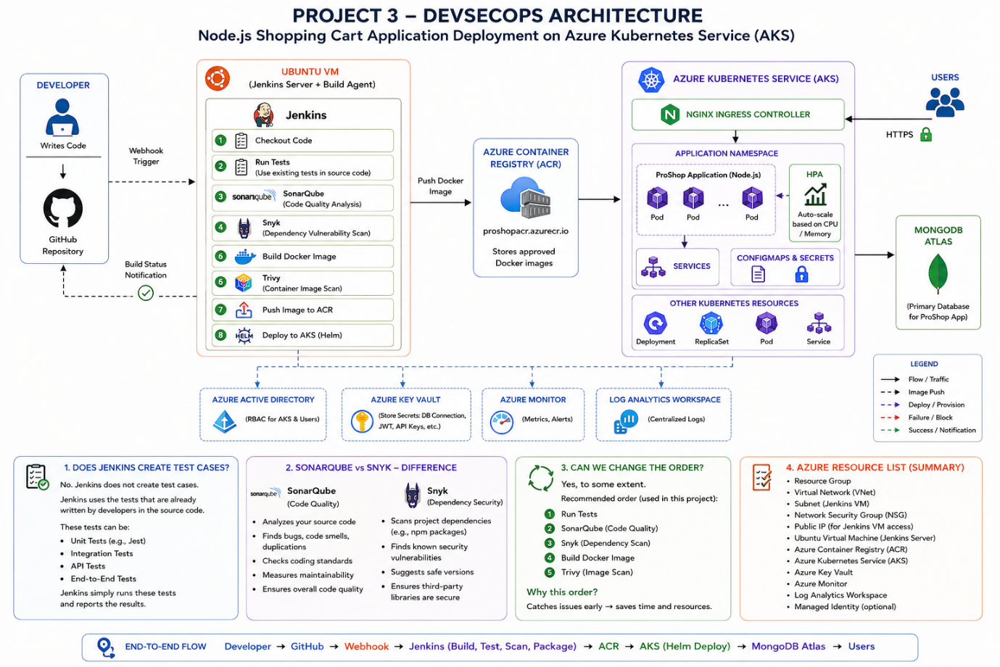

### High-Level Flow

```text
Developer
    |
    v
GitHub Repository
    |
    | Webhook
    v
Jenkins on Ubuntu VM
    |
    |-- Checkout
    |-- Install Dependencies
    |-- Run Tests
    |-- SonarQube Analysis
    |-- Quality Gate
    |-- Snyk Scan
    |-- Docker Build
    |-- Trivy Scan
    |-- Push Image
    `-- Deploy
           |
           v
Azure Container Registry
           |
           v
Azure Kubernetes Service
           |
           v
Helm Release
           |
           v
NGINX Ingress
           |
           v
ClusterIP Service
           |
           v
Application Pods
           |
           v
Cloud Database
```

## Technology Stack

| Area | Technology |
|---|---|
| Application | Node.js / Express / React |
| Source Control | GitHub |
| CI/CD | Jenkins |
| Infrastructure as Code | Terraform |
| Containerization | Docker |
| Container Registry | Azure Container Registry |
| Orchestration | Azure Kubernetes Service |
| Package / Deployment Management | Helm |
| Ingress | NGINX Ingress Controller |
| Code Quality | SonarQube |
| Dependency Security | Snyk |
| Container Security | Trivy |
| Database | MongoDB-compatible cloud database |
| Cloud | Microsoft Azure |
| Administration | Azure CLI, kubectl, Helm CLI |

## Local Application Validation

The frontend and backend were first tested locally before cloud deployment.

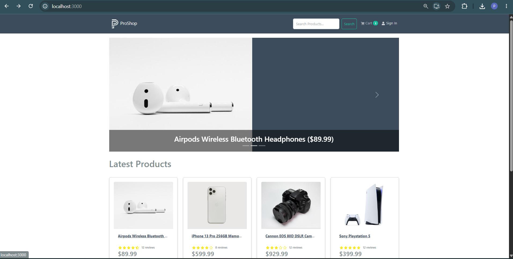

The documented local endpoints were:

```text
Frontend: http://localhost:3000
Backend:  http://localhost:5000
```

## Docker Containerization

A Dockerfile was created for the ProShop application. During local validation, the application and MongoDB containers were connected through Docker networking.

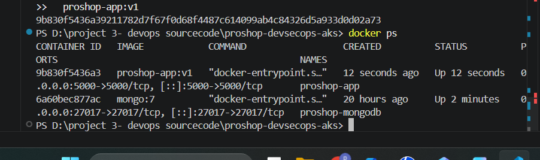

This verified container-to-container communication before moving the workload to Azure.

## Infrastructure as Code with Terraform

Terraform was used to provision the Azure infrastructure.

The Terraform configuration included:

```text
providers.tf
variables.tf
main.tf
outputs.tf
terraform.tfvars
.gitignore
```

### Terraform Initialization

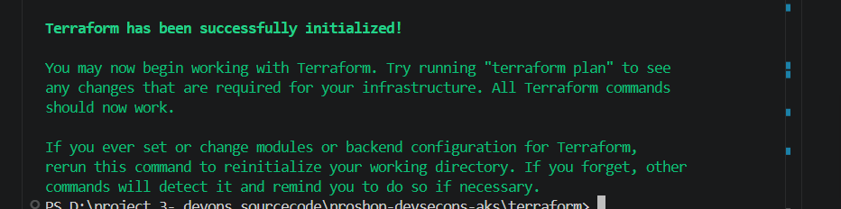

### Terraform Plan

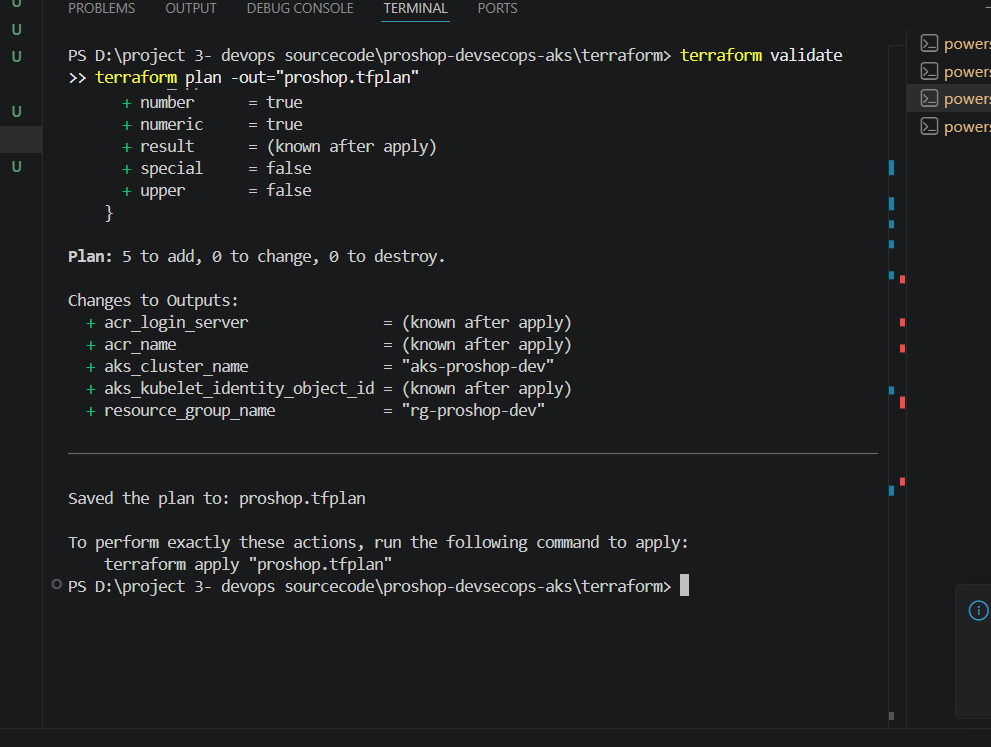

The plan was reviewed before infrastructure creation.

### Terraform Apply

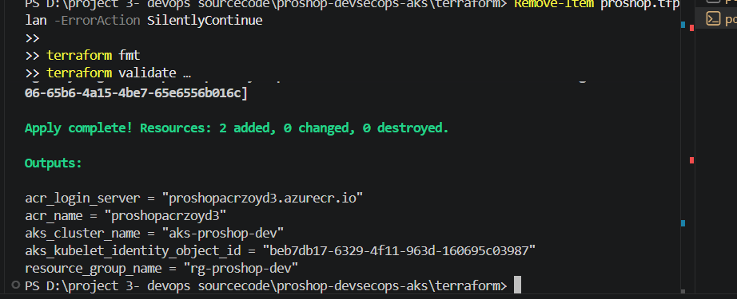

The resulting environment included the Azure resource group, ACR, AKS and supporting cloud resources required by the project.

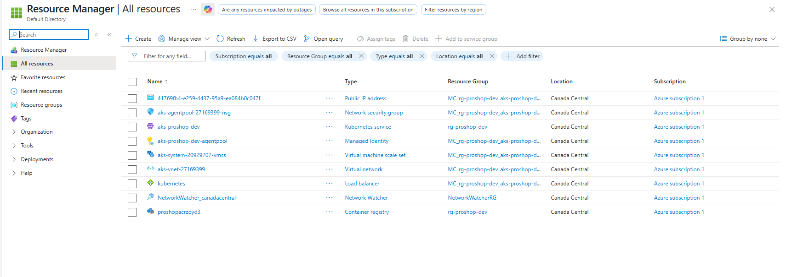

## Azure Container Registry

The ProShop Docker image was pushed to Azure Container Registry.

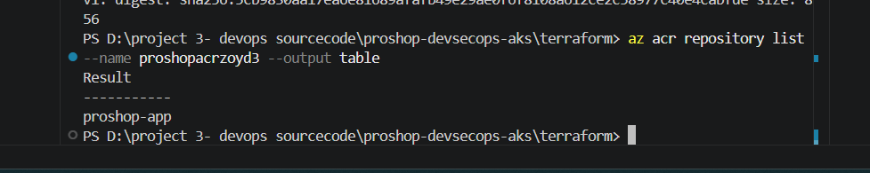

The image flow is:

```text
Source Code
    |
    v
Docker Build
    |
    v
Security Scan
    |
    v
Azure Container Registry
    |
    v
AKS Deployment
```

## Azure Kubernetes Service

After provisioning AKS, `kubectl` was configured to communicate with the cluster.

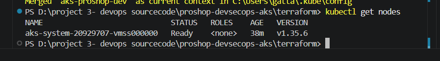

This confirmed that the Kubernetes node was available and ready.

## Helm Deployment

A Helm chart was created to package the Kubernetes deployment configuration.

Before deployment, the chart was checked with Helm lint.

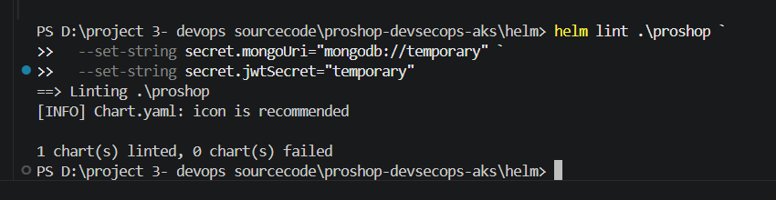

The application was then installed into AKS as a Helm release.

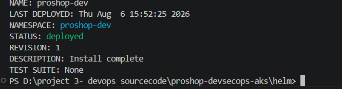

Application logs confirmed that the backend was running in production mode and connecting to the configured cloud database.

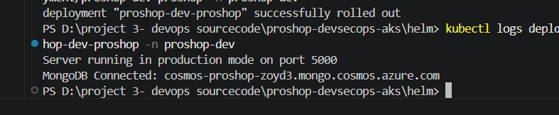

## Kubernetes Traffic Flow

The final application traffic flow uses NGINX Ingress:

```text
Internet
   |
   v
NGINX Ingress Controller
   |
   v
Ingress Resource
   |
   v
ProShop ClusterIP Service
   |
   v
Application Pod(s)
```

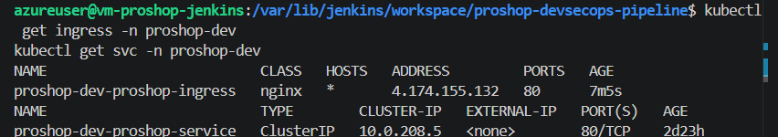

This keeps the application service internal to the cluster while NGINX handles external HTTP traffic.

## Jenkins Server

A dedicated Ubuntu VM was provisioned for Jenkins.

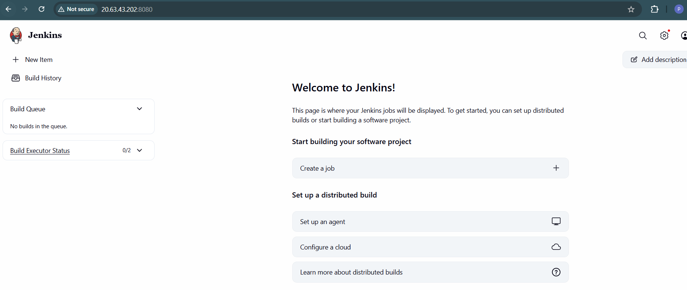

The Jenkins host was prepared with the tools required by the pipeline, including:

- Java
- Jenkins
- Docker
- Git
- Azure CLI
- kubectl
- Helm
- Trivy
- Node.js
- Snyk
- SonarQube integration

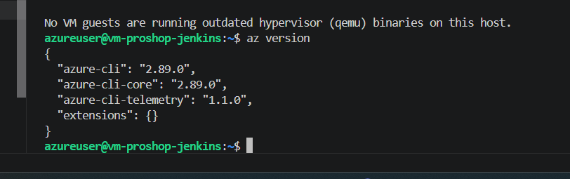

### Kubernetes Tooling

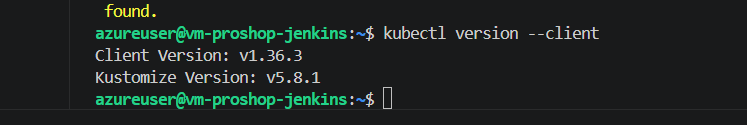

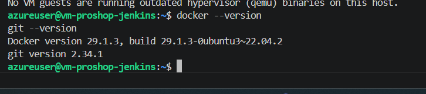

## DevSecOps Security Tooling

### SonarQube

SonarQube was integrated with Jenkins for static code-quality analysis.

In this implementation, SonarQube runs on the same VM as Jenkins, allowing Jenkins to communicate with it internally rather than requiring the SonarQube service to be exposed publicly.

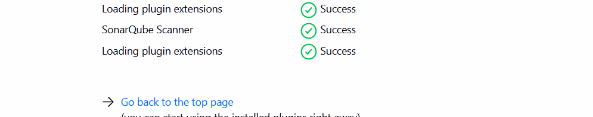

### Snyk

Snyk was installed for dependency vulnerability scanning.

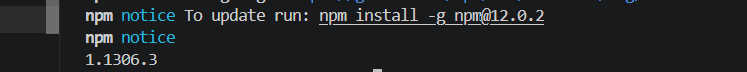

### Trivy

Trivy was installed on the Jenkins VM for container image vulnerability scanning.

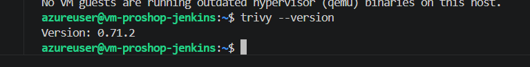

## Jenkins CI/CD Pipeline

The final Jenkins pipeline connects the development, security, container, registry, and Kubernetes stages.

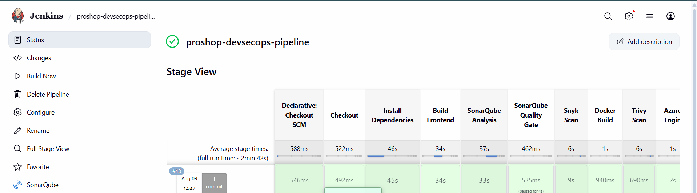

A simplified pipeline is:

```text
GitHub
  |
  v
Checkout
  |
  v
Install Dependencies
  |
  v
Run Tests
  |
  v
SonarQube Analysis
  |
  v
Quality Gate
  |
  v
Snyk Dependency Scan
  |
  v
Docker Build
  |
  v
Trivy Image Scan
  |
  v
Push to ACR
  |
  v
Deploy to AKS
```

## Authentication and Credentials

Jenkins requires credentials to authenticate with Azure and the security tooling. These values are stored in the Jenkins Credentials store and referenced by the pipeline rather than being written directly into the Jenkinsfile.

> **Security note:** passwords, API tokens, service-principal secrets, subscription identifiers, and other credentials are intentionally excluded from this README and its screenshots. Any credentials that were exposed during project documentation should be rotated before the repository is made public.

## Deployment Verification

The implementation verified:

- Frontend and backend running locally
- Docker application/database networking
- Terraform initialization and infrastructure provisioning
- Azure Container Registry image push
- AKS cluster connectivity
- Helm chart validation
- Successful Helm release
- Application pods running in AKS
- Backend cloud-database connectivity
- Jenkins server/tool installation
- SonarQube integration
- Snyk installation
- Trivy installation
- Jenkins pipeline execution
- NGINX Ingress routing to the application service

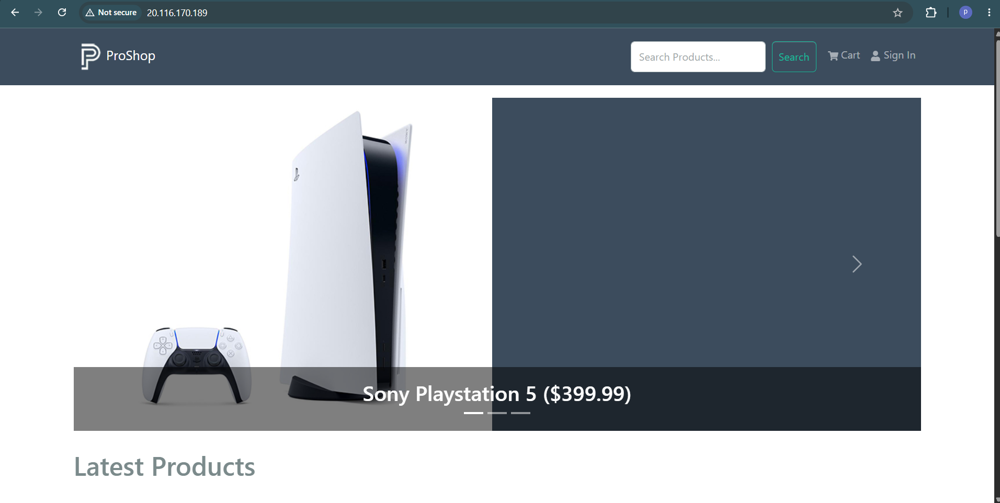

## DevSecOps Controls

This project introduces security checks at multiple points rather than treating security as a final deployment step.

| Pipeline Area | Control |
|---|---|
| Source / Code | SonarQube analysis |
| Dependencies | Snyk vulnerability scanning |
| Container Image | Trivy vulnerability scanning |
| Credentials | Jenkins Credentials store |
| Image Storage | Azure Container Registry |
| Deployment | Kubernetes / Helm |
| External Traffic | NGINX Ingress |

## Why Jenkins?

Jenkins acts as the automation engine for the project. It does not create application tests automatically; it orchestrates the tests and commands defined for the application and controls whether later pipeline stages should run.

The GitHub webhook provides event-driven triggering so Jenkins can start the pipeline when repository changes occur.

## Why ACR + AKS?

Azure Container Registry provides a private Azure location for storing versioned application images, while AKS provides Kubernetes orchestration for running and managing those images.

```text
Docker Image
    |
    v
ACR
    |
    v
AKS
    |
    +-- Deployment
    +-- Pods
    +-- Service
    `-- Ingress
```

## Why Helm?

Helm packages Kubernetes configuration into a reusable chart. Instead of managing multiple Kubernetes manifests independently, application configuration can be deployed and upgraded as a versioned Helm release.

## Challenges and Solutions

| Challenge | Solution |
|---|---|
| Needed repeatable Azure infrastructure | Provisioned infrastructure using Terraform |
| Needed consistent application packaging | Containerized ProShop with Docker |
| Needed a private image repository | Used Azure Container Registry |
| Needed container orchestration | Deployed to Azure Kubernetes Service |
| Needed repeatable Kubernetes deployment | Created and deployed a Helm chart |
| Needed automated CI/CD | Used Jenkins on a dedicated Ubuntu VM |
| Needed code-quality analysis | Integrated SonarQube |
| Needed dependency scanning | Installed Snyk |
| Needed image vulnerability scanning | Installed Trivy |
| Needed controlled external routing | Used NGINX Ingress with an internal ClusterIP service |

## Key Learnings

This project provided hands-on experience with:

- Jenkins pipeline design
- GitHub webhook-based CI/CD triggering
- Terraform infrastructure provisioning
- Docker containerization and networking
- Azure Container Registry
- Azure Kubernetes Service
- Kubernetes pods, services and ingress
- Helm charts and releases
- NGINX Ingress Controller
- SonarQube integration
- Snyk dependency scanning
- Trivy container scanning
- Azure CLI and kubectl
- Jenkins credential management
- End-to-end DevSecOps workflow design

## Future Improvements

Potential next improvements include:

1. Enforce explicit vulnerability thresholds that automatically stop releases on unacceptable findings.
2. Add automated integration and post-deployment smoke tests.
3. Add Horizontal Pod Autoscaling and resource requests/limits if not already configured in the final chart.
4. Add Azure Monitor / Container Insights for AKS observability.
5. Store application secrets using a dedicated secrets-management integration.
6. Add separate Development, Staging and Production Kubernetes environments.
7. Add image tagging based on Git commit SHA or Jenkins build number.

## Repository Structure

A typical repository structure for this implementation is:

```text
proshop-devsecops-aks/
|
|-- frontend/
|-- backend/
|-- Dockerfile
|-- Jenkinsfile
|
|-- terraform/
|   |-- providers.tf
|   |-- variables.tf
|   |-- main.tf
|   |-- outputs.tf
|   `-- terraform.tfvars
|
|-- helm/
|   `-- proshop/
|       |-- Chart.yaml
|       |-- values.yaml
|       `-- templates/
|
|-- images/
`-- README.md
```

## Project Summary

This project demonstrates an end-to-end DevSecOps deployment of a Node.js shopping application to Azure Kubernetes Service.

Terraform provisions the Azure infrastructure, Docker packages the application, ACR stores the image, Jenkins orchestrates the CI/CD and security stages, SonarQube/Snyk/Trivy provide layered checks, Helm manages the Kubernetes release, and NGINX Ingress routes user traffic to the application running in AKS.

The result is a practical cloud-native pipeline that combines infrastructure automation, CI/CD, container security, Kubernetes deployment, and application delivery in one project.
